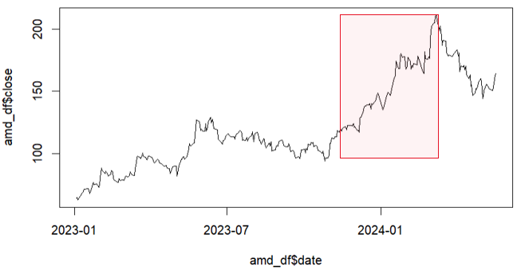

```{r setup, include=FALSE}
knitr::opts_chunk$set(echo = TRUE)
```

## Algorithmic Trading Strategy

## Introduction

In this assignment, you will develop an algorithmic trading strategy by incorporating financial metrics to evaluate its profitability. This exercise simulates a real-world scenario where you, as part of a financial technology team, need to present an improved version of a trading algorithm that not only executes trades but also calculates and reports on the financial performance of those trades.

## Background

Following a successful presentation to the Board of Directors, you have been tasked by the Trading Strategies Team to modify your trading algorithm. This modification should include tracking the costs and proceeds of trades to facilitate a deeper evaluation of the algorithm’s profitability, including calculating the Return on Investment (ROI).

After meeting with the Trading Strategies Team, you were asked to include costs, proceeds, and return on investments metrics to assess the profitability of your trading algorithm.

## Objectives

1. **Load and Prepare Data:** Open and run the starter code to create a DataFrame with stock closing data.

2. **Implement Trading Algorithm:** Create a simple trading algorithm based on daily price changes.

3. **Customize Trading Period:** Choose your entry and exit dates.

4. **Report Financial Performance:** Analyze and report the total profit or loss (P/L) and the ROI of the trading strategy.

5. **Implement a Trading Strategy:** Implement a trading strategy and analyze the total updated P/L and ROI. 

6. **Discussion:** Summarise your finding.


## Instructions

### Step 1: Data Loading

Start by running the provided code cells in the "Data Loading" section to generate a DataFrame containing AMD stock closing data. This will serve as the basis for your trading decisions. First, create a data frame named `amd_df` with the given closing prices and corresponding dates. 

```{r load-data}

# Load data from CSV file
amd_df <- read.csv("AMD.csv")

# Convert the date column to Date type and Adjusted Close as numeric 
amd_df$date <- as.Date(amd_df$Date)
amd_df$close <- as.numeric(amd_df$Adj.Close)

amd_df <- amd_df[, c("date", "close")]
```


## Plotting the Data

Plot the closing prices over time to visualize the price movement.
```{r plot}
plot(amd_df$date, amd_df$close,'l')
```


## Step 2: Trading Algorithm
Implement the trading algorithm as per the instructions. You should initialize necessary variables, and loop through the dataframe to execute trades based on the set conditions.

- Initialize Columns: Start by ensuring dataframe has columns 'trade_type', 'costs_proceeds' and 'accumulated_shares'.
- Change the algorithm by modifying the loop to include the cost and proceeds metrics for buys of 100 shares. Make sure that the algorithm checks the following conditions and executes the strategy for each one:
  - If the previous price = 0, set 'trade_type' to 'buy', and set the 'costs_proceeds' column to the current share price multiplied by a `share_size` value of 100. Make sure to take the negative value of the expression so that the cost reflects money leaving an account. Finally, make sure to add the bought shares to an `accumulated_shares` variable.
  - Otherwise, if the price of the current day is less than that of the previous day, set the 'trade_type' to 'buy'. Set the 'costs_proceeds' to the current share price multiplied by a `share_size` value of 100.
  - You will not modify the algorithm for instances where the current day’s price is greater than the previous day’s price or when it is equal to the previous day’s price.
  - If this is the last day of trading, set the 'trade_type' to 'sell'. In this case, also set the 'costs_proceeds' column to the total number in the `accumulated_shares` variable multiplied by the price of the last day.

```{r period}
# Define start date and end date
start_date <- as.Date("2023-01-01")
end_date <- as.Date("2024-05-17")

# Filter the data to include only the trading period
amd_df <- amd_df[amd_df$date >= start_date & amd_df$date <= end_date,]

```

```{r trading}


# Initialize columns for trade type, cost/proceeds, and accumulated shares in amd_df
amd_df$trade_type <- NA
amd_df$costs_proceeds <- NA 
amd_df$accumulated_shares <- 0

# Initialize variables for trading logic
share_size <- 100

# Loop over every line
for (i in 1:nrow(amd_df)) {
  # First day - Purchasing
  if (i == 1) {
    amd_df$trade_type[1] <- "buy"
    amd_df$costs_proceeds[1] <- -1*amd_df$close[i] * share_size
    amd_df$accumulated_shares[1] <- share_size
  
  } else if (i > 1 && i != nrow(amd_df)) {
    # Purchasing  
    if (amd_df$close[i-1] > amd_df$close[i]) {
        amd_df$trade_type[i] <- "buy"
        amd_df$costs_proceeds[i] <- -1*amd_df$close[i] * share_size
        amd_df$accumulated_shares[i] <- amd_df$accumulated_shares[i-1] + share_size
    
    # Not purchasing
    } else {
        amd_df$trade_type[i] <- "hold"
        amd_df$accumulated_shares[i] <- amd_df$accumulated_shares[i-1]
    }
  
  # Final day, selling all shares
  } else if (i == nrow(amd_df)) {
      amd_df$trade_type[i] <- "sell"
      amd_df$costs_proceeds[i] <- amd_df$close[i] * amd_df$accumulated_shares[i - 1]
      amd_df$accumulated_shares[i] <- 0
  } 
}

```


## Step 3: Customize Trading Period
- Define a trading period you wanted in the past five years 
```{r period_1}
# Define start date
start_date <- as.Date("2023-01-01")
end_date <- as.Date("2024-05-17")

# Filter the data to include only the trading period
amd_df <- amd_df[amd_df$date >= start_date & amd_df$date <= end_date,]

```


## Step 4: Run Your Algorithm and Analyze Results
After running your algorithm, check if the trades were executed as expected. Calculate the total profit or loss and ROI from the trades.

- Total Profit/Loss Calculation: Calculate the total profit or loss from your trades. This should be the sum of all entries in the 'costs_proceeds' column of your dataframe. This column records the financial impact of each trade, reflecting money spent on buys as negative values and money gained from sells as positive values.
- Invested Capital: Calculate the total capital invested. This is equal to the sum of the 'costs_proceeds' values for all 'buy' transactions. Since these entries are negative (representing money spent), you should take the negative sum of these values to reflect the total amount invested.
- ROI Formula: $$\text{ROI} = \left( \frac{\text{Total Profit or Loss}}{\text{Total Capital Invested}} \right) \times 100$$

```{r}
total_profitloss <- 0
capital_invested <- 0

for(i in 1:nrow(amd_df)) {
  # sum all cost proceeds for net total
  if (is.na(amd_df$costs_proceeds[i]) == FALSE) {
    total_profitloss <- total_profitloss + amd_df$costs_proceeds[i]

    # sum all invested money
    if (amd_df$costs_proceeds[i] < 0) {
      capital_invested <- capital_invested + amd_df$costs_proceeds[i]
    }
  }
}

ROI <-  total_profitloss/(-1*capital_invested) * 100

cat("Total profit/loss: ", total_profitloss, "\nCapital invested: ", -1*capital_invested, "\nROI: ",ROI, "\n \nOnly buying when prices are decreasing from time period 2023-01-01 to 2024-05-17, yields an ROI of ", ROI, " %")

```

## Step 5: Profit-Taking Strategy or Stop-Loss Mechanisum (Choose 1)
- Option 1: Implement a profit-taking strategy that you sell half of your holdings if the price has increased by a certain percentage (e.g., 20%) from the average purchase price.
- Option 2: Implement a stop-loss mechanism in the trading strategy that you sell half of your holdings if the stock falls by a certain percentage (e.g., 20%) from the average purchase price. You don't need to buy 100 stocks on the days that the stop-loss mechanism is triggered.


```{r option}
# Profit Taking Strategy
amd_df$trade_type <- NA
amd_df$costs_proceeds <- NA  
amd_df$accumulated_shares <- 0

# for calculating our_avg_price
amd_df$our_avg_price <- 0 # a record of avg prices
amd_df$our_acc_cost <- 0 # "total money" invested

share_size <- 100

for (i in 1:nrow(amd_df)) {
  # First day - Purchasing
  if (i == 1) {
    amd_df$trade_type[1] <- "buy"
    amd_df$costs_proceeds[1] <- (-1) * amd_df$close[i] * share_size
    amd_df$accumulated_shares[1] <- share_size
    
    amd_df$our_acc_cost[1] <- amd_df$costs_proceeds[1]
    amd_df$our_avg_price[1] <- amd_df$close[1]
    
  } else if (i > 1 && i != nrow(amd_df)) {
      # Calculate the avg price
      amd_df$our_avg_price[i] <- -1 * amd_df$our_acc_cost[i-1] / amd_df$accumulated_shares[i-1]
      
      # Selling - Profit Taking
      if (amd_df$close[i] > 1.20 * amd_df$our_avg_price[i]) {
        
          amd_df$trade_type[i] <- "sell"
          # Sell half of holdings
          amd_df$costs_proceeds[i] <- amd_df$close[i] * (amd_df$accumulated_shares[i-1] / 2)
          # Lose half of holdings
          amd_df$accumulated_shares[i] <- amd_df$accumulated_shares[i-1] / 2
  
          # decrease the total investment cost by avg * stocks_sold
          stocks_sold <- amd_df$accumulated_shares[i]
          amd_df$our_acc_cost[i] <- amd_df$our_acc_cost[i-1] + ((amd_df$our_avg_price[i-1] * stocks_sold))

      # Purchasing - On the downhill     
      } else if (amd_df$close[i-1] > amd_df$close[i]) {
           
          amd_df$trade_type[i] <- "buy"
          amd_df$costs_proceeds[i] <- -1 * amd_df$close[i] * share_size
          amd_df$accumulated_shares[i] <- amd_df$accumulated_shares[i - 1] + share_size
          
          amd_df$our_acc_cost[i] <- amd_df$our_acc_cost[i - 1] + amd_df$costs_proceeds[i]
          
      # Holding - do nothing
      } else {
          amd_df$trade_type[i] <- "hold"
          amd_df$accumulated_shares[i] <- amd_df$accumulated_shares[i - 1]
          amd_df$accumulated_cost[i] <- amd_df$accumulated_cost[i - 1]
          
          amd_df$our_acc_cost[i] <- amd_df$our_acc_cost[i-1]
      }
    
    # Last day, we sell all holdings
  } else if (i == nrow(amd_df)) {
      amd_df$trade_type[i] <- "sell"
      amd_df$costs_proceeds[i] <- amd_df$close[i] * amd_df$accumulated_shares[i-1]
      
      amd_df$our_avg_price[i] <- NA
  } 
  
}

```


## Step 6: Summarize Your Findings
- Did your P/L and ROI improve over your chosen period?
- Relate your results to a relevant market event and explain why these outcomes may have occurred.


```{r}
cat("First Algorithm \nTotal profit/loss: ", total_profitloss, "\nCapital invested: ", -1*capital_invested, "\nROI: ",ROI, "\n \nOnly buying when prices are decreasing from time period 2023-01-01 to 2024-05-17, yields an ROI of ", ROI, " % \n\n")


total_profitloss_2 <- 0
capital_invested_2 <- 0

for(i in 1:nrow(amd_df)) {

  if (is.na(amd_df$costs_proceeds[i]) == FALSE) {
    total_profitloss_2 <- total_profitloss_2 + amd_df$costs_proceeds[i]

    if (amd_df$costs_proceeds[i] < 0) {
      capital_invested_2 <- capital_invested_2 + amd_df$costs_proceeds[i]
    }
  }
}

ROI_2 <-  total_profitloss_2/(-1*capital_invested_2) * 100

cat("Second Algorithm \nTotal profit/loss: ", total_profitloss_2, "\nCapital invested: ", -1*capital_invested_2, "\nROI: ",ROI_2, "\n \nOnly buying when prices are decreasing and selling when the closing stock price is greater than the average holding price by 20% from time period 2023-01-01 to 2024-05-17, yields an ROI of ", ROI_2, " %")
```
The first algorithm made $457,889 more money than the second algorithm, however also invested \$1,039,329 more. This still results in a higher ROI of 35.72% compared to the second algorithm’s 26.70%. 

The code of the first algorithm simply bought every time the closing price is less than the previous day’s closing price. The second algorithm utilizes the same buying strategy as the first one but has an additional take-profit condition that if the current closing price is greater than 20% of the average price of our portfolio, we sell half our shares. The first algorithm outperforms the second one due to the upwards nature of the selected time frame causing it to cash out too early.

\n
Over the chosen investment period, we have the following graph,

